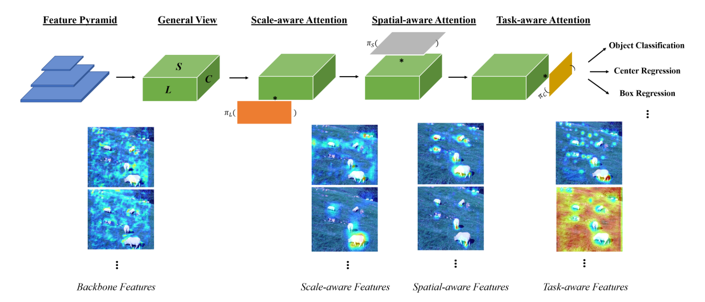
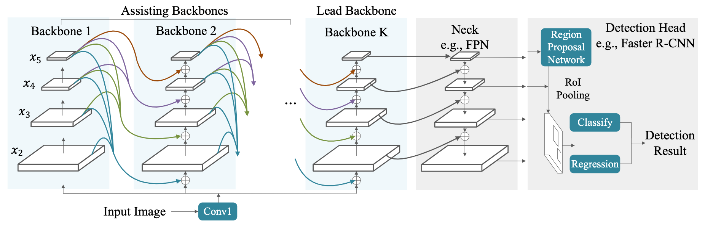
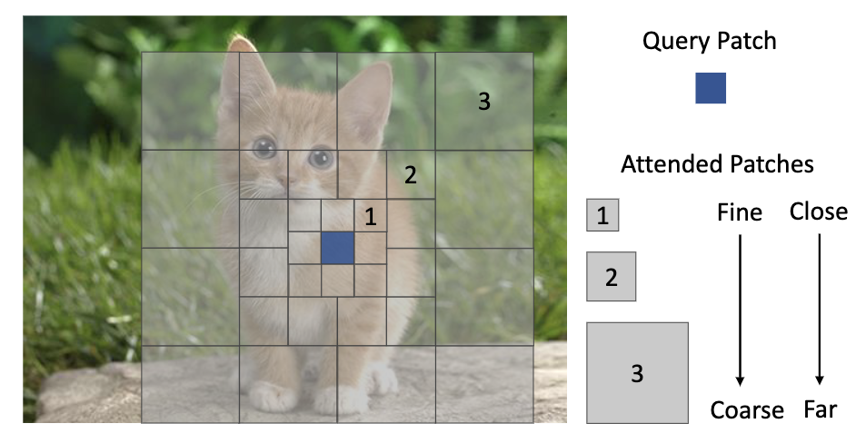
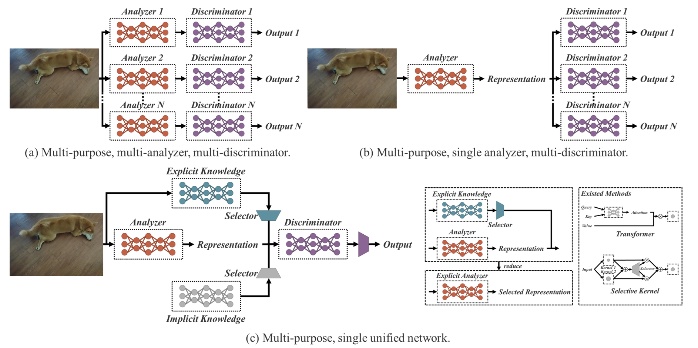
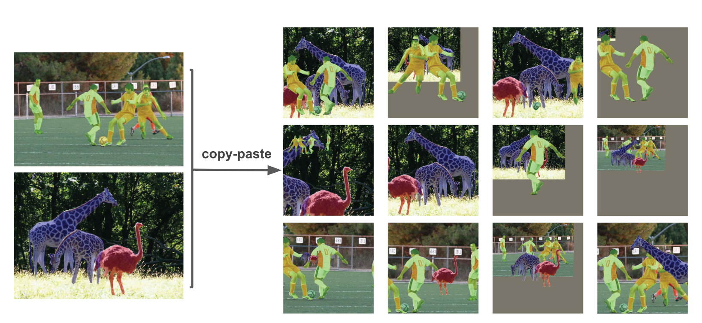
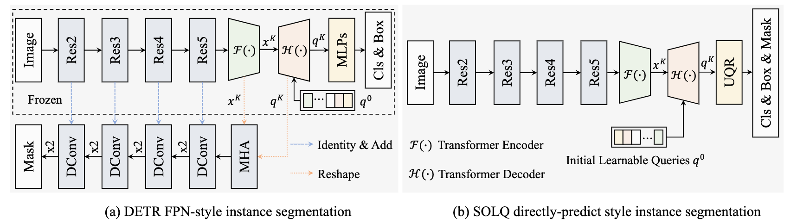

# COCO Leaderboard

Based on [paperswithcode](https://paperswithcode.com/sota/object-detection-on-coco), 2022.3.22

[TOC]

## Summary

### Leaderboard

*Italic* denotes unique contribution

| Rank | Method            | AP box | Extra Data (Detection)                                     | Pretrain Data                 | Backbone            | Model                     | Training                              | Scale  |
| ---- | ----------------- | ------ | ---------------------------------------------------------- | ----------------------------- | ------------------- | ------------------------- | ------------------------------------- | ------ |
| 1    | DINO              | 63.3   | Object365                                                  | IN22K                         | SwinL               | *DINO* (DETR)             |                                       | multi  |
| 2    | SwinV2            | 63.1   | Object365                                                  | IN22K-ext-70M                 | *SwinG*             | HTC++                     |                                       | multi  |
| 3    | Florence          | 62.4   | FLOD9M (COCO, O365, LVIS, OpenImages), IN22K self-training | FLD900M                       | SwinH               | DyHead                    | *multimodal, multi-task*              | multi  |
| 4    | GLIP              | 61.5   | FourODs, GoldG+                                            | 27M grounding data            | SwinL               | DyHead                    | *object-word contrastive pretraining* | multi  |
| 5    | Soft Teacher      | 61.3   | Object365                                                  | IN22K                         | SwinL               | HTC++                     | *semi-supervised*                     | multi  |
| 6    | DyHead            | 60.6   | IN22K self-training                                        | IN22K                         | SwinL               | *DyHead* (Mask RCNN)      |                                       | multi  |
| 7    | CBNetV2           | 60.1   |                                                            | IN22K                         | SwinL               | HTC                       | *composite backbone*                  | multi  |
| 8    | Focal Transformer | 58.9   |                                                            | Swin init, finetune on IN1K   | *Focal Transformer* | DyHead                    |                                       | multi  |
| 9    | YOLOR             | 57.3   |                                                            | IN1K                          | CSPDarkNet53        | *YOLOR* (YOLOv4-CSP)      |                                       | single |
| 10   | CopyPaste         | 57.3   | self-training (unlabeled COCO, O365)                       | IN (self-training checkpoint) | EfficientNet        | FPN                       | *data augmentation*                   | single |
| 11   | SOLQ              | 56.5   |                                                            | IN22K                         | SwinL               | *SOLQ* (DETR)             |                                       | single |
| 12   | CenterNet2        | 56.4   |                                                            |                               | Res2Net101-DCN      | *CenterNet2*              | *anchor free*                         | single |
| 13   | QueryInst         | 56.1   |                                                            |                               | ResNet101           | *QueryInst*               |                                       | single |
| 14   | Scaled YOLOv4     | 55.8   |                                                            |                               | CSPDarkNet53        | YOLOv4                    | *network scaling approach*            | single |
| 15   | DetectoRS         | 55.7   |                                                            |                               | ResNeXt101          | *DetectoRS*               |                                       | multi  |
| 16   | Mish              | 55.2   |                                                            |                               | CSP                 | YOLOv4                    | *activation Function*                 | multi  |
| 17   | Self-training     | 54.3   | self-training                                              |                               | SpineNet            | RetinaNet                 | *self-training*                       | single |
| 18   | USB               | 54.1   |                                                            |                               | Res2Net101-DCN      | *UniverseNet* (RetinaNet) |                                       | multi  |
| 19   | EfficientDet      | 53.7   |                                                            |                               | EfficientNet        | *EfficientDet* (BiFPN)    |                                       | single |
| 20   | PAA               | 53.5   |                                                            |                               | ResNeXt-152-DCN     | *PAA* (RetinaNet)         | *anchor assignment*                   | multi  |
| 21   | LSNet             | 53.5   |                                                            |                               | Res2Net-101-DCN     | *LSNet*                   |                                       | multi  |
| 22   | ResNeSt           | 53.3   |                                                            |                               | *ResNeSt-200*       | Cascade-RCNN              |                                       | multi  |
| 23   | GFLv2             | 53.3   |                                                            |                               | Res2Net-101-DCN     | *Generalized Focal Loss*  | *loss function*                       | multi  |
| 24   | RelationNet++     | 52.7   |                                                            |                               | ResNeXt-101-DCN     | *RelationNet++*           |                                       | multi  |
| 25   | Deformable DETR   | 52.3   |                                                            |                               | ResNeXt-101-DCN     | *Deformable DETR* (DETR)  |                                       | multi  |

### Related Papers

* TODO

1. HTC++
2. CSPNet
3. Res2Net
4. SpineNet
5. ResNeXt
6. ResNeSt
7. ATSS

* Done

1. ResNet
2. RCNN
3. Fast RCNN
4. Faster RCNN
5. Mask RCNN
6. FPN
7. Focal Loss (RetinaNet)
8. YOLOv4
9. DETR
10. Deformable Conv
11. SimMIM
12. DN-DETR
13. DAB-DETR
14. HTC
15. STAC
16. FixMatch
17. CenterNet
18. Swin Transformer
19. CLIP
20. EfficientNet

## Methods

### 1. DINO

基于DETR提出改进：

1. Contrastive DeNoising Training

在DN-DETR的基础上增加了对比学习，即正负样本同时添加噪声，对于每个anchor query需要完成降噪、判断有无物体。添加smaller noise的作为正样本，其他作为负样本，主要目的是改善box匹配，加速训练

2. Mixed Query Selection

与之前工作把anchor和query都设成静态（DETR；query太多，计算量大且难以收敛）或都设成动态（Deformable DETR；可能有多个物体或只有物体的一部分）不同，把Content Queries设为静态（可学习），Anchor Boxes设为动态（由encoder初始化）

3. Look Forward Twice

box refine时增加前一层的特征作为输入，类似于增大感受野

### 2. SwinV2

Swin V1的问题：

1. 随着层数加深，深层激活值提升，特征方差变大，变得不稳定
2. 分辨率改变时性能下降

改进：

1. 对于方差大的问题，将LayerNorm移动到MLP/Attention之后，残差连接之前
2. 对于attention map易被少数像素主导的问题，将attention计算方式改成scaled cosine
3. 对于跨分辨率问题，提出log continuous position bias，减少插值比率

4. 一些工程技巧减少显存占用
5. 额外数据：ImageNet-22K扩展五倍，自监督训练（SimMIM）

### 3. Florence

计算机视觉任务:分类、检索、检测、VQA、Image Caption、视频检索、动作识别

迁移学习：finetune，linear probing，few shot，zero shot

与CLIP等多模态模型相比，扩展到了object级别、视频特征

图片encoder使用swin等，文本使用roberta，进行Unified Constrastive Learning。检测部分使用Dynamic Head模型

### 4. GLIP

统一phrase grounding和detecion，利用grounding数据进行物体和文本的对比学习

与CLIP不同，使用Deep Fusion融合文本和视觉encoder

可以zero shot预测训练数据中未出现的类别，在LVIS上也有提升

### 5. Soft Teacher

半监督目标检测，使用伪标签，相比于STAC特色是端到端

在每个训练 step 中同时进行生成伪标签、利用伪标签对无标签图片进行训练。在每个 batch中随机抽样有标签和无标签数据，student模型进行检测训练，teacher模型（student的EMA平均）对无标签数据生成伪标签

类似FixMatch，无监督数据进行强弱两种增强，分别进入student和teacher。性能依赖于伪标签的质量

cls伪标签：采用soft teacher，使用teacher模型的分类分数来加权student模型预测proposal的loss。低阈值+soft teacher的效果好于高阈值

reg伪标签：采用box jittering，多次抖动伪前景框proposal，利用teacher模型进行回归，将回归框的方差用作可靠性度量，高可靠性（方差低）的proposal用于student定位分支的训练

### 6. Dynamic Head

在一个head里同时实现三种感知。对feature pyramid连续进行三种attention操作，分别针对scale, spatial和task，即layer, space(H,W), channel三个维度

dynamic head模块可以添加到one-stage和two-stage检测器中，one-stage中放在FPN backbone后、class box center的分类器前，two-stage中将最后一个task-aware attention放在ROI Pooling后、class box分类器前，其余的放在ROI Pooling前

### 7. CBNetV2

将多个相同结构Backbone使用Dense Higher-Level Composition的方式组合在一起，每个layer给所有更浅layer提供输入

为了避免深度带来的训练困难，在训练时使用assisting backbone（前K-1个backbone中的每个）的输出训练同样权重的detection head2，loss作为assistant supervision

### 8. Focal Transformer

粗粒度导致sub-optimal，细粒度导致计算开销过大。以细粒度的方式关注离自己近的token，以粗粒度的方式关注离自己远的token。将较远的patch进行pooling聚合，增大感受野

但显存占用和计算量较大，对高分辨率的预测任务不友好

### 9. YOLOR

提出了一个统一的网络来同时编码显式知识和隐式知识，在网络中执行了核空间对齐、预测细化和多任务学习来学习隐式知识，同时对多个任务形成统一的表示

隐式知识：

1. 利用投影向量的内积和隐式表示来达到降低流形空间维度的目的
2. 对输出特征和隐式表征进行加法和乘法运算，这样就可以对核空间进行变换、旋转和缩放，以对齐神经网络的每个输出核空间
3. 引入加法，预测中心坐标的偏移；引入乘法，搜索锚框的超参数集；分别使用点乘和concat来执行多任务特征选择

传统神经网络的表示空间专注于特定任务，对于其他任务不变。通用的网络希望对于所有潜在任务都有效。

特征对齐：在FPN的每一个特征映射层添加隐式知识进行特征对齐

目标检测预测细化：在YOLO的每一个输出层添加隐式知识进行预测细化

为训练多任务训练一个规范的表征，通过给每个任务分支引入隐式表征增强表征能力

总结：引入隐式知识，仅增加不到万分一的参数量和计算量，模型性能得到有意义的提升，同时收敛更快。

### 10. CopyPaste

将一个图片的物体直接复制到另一个图片。与之前的复制粘贴方法不同，不需要对上下文建模获取粘贴位置

未使用旋转、高斯模糊，使用了水平翻转、大尺度抖动

作为半监督训练方法：对未标记数据生成伪标签、将ground truth实例粘贴进来作为新数据

baseline模型在LVIS 2020挑战赛获胜者的基础上提升3.6%

### 11. SOLQ

在DETR上增加预测mask的head。其中主要贡献是UQR模块，将mask从二维feature map压缩编码到一维向量，从而可以用head预测。测试时将一维向量解码为mask。编解码方式有Sparse Coding, PCA, DCT
