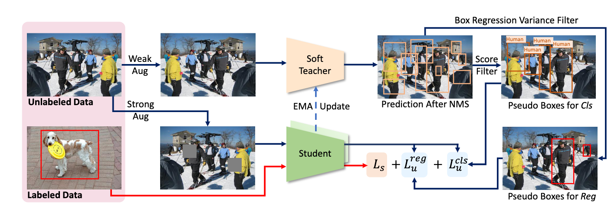
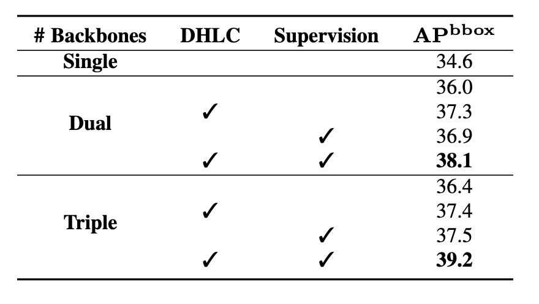
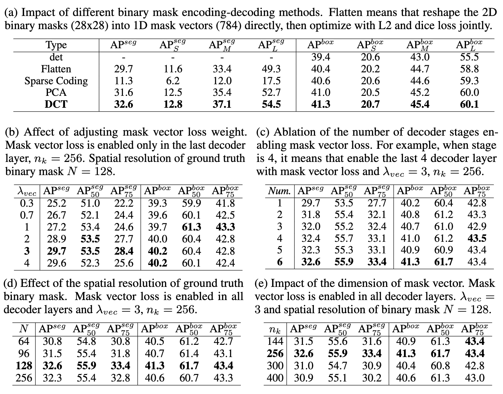
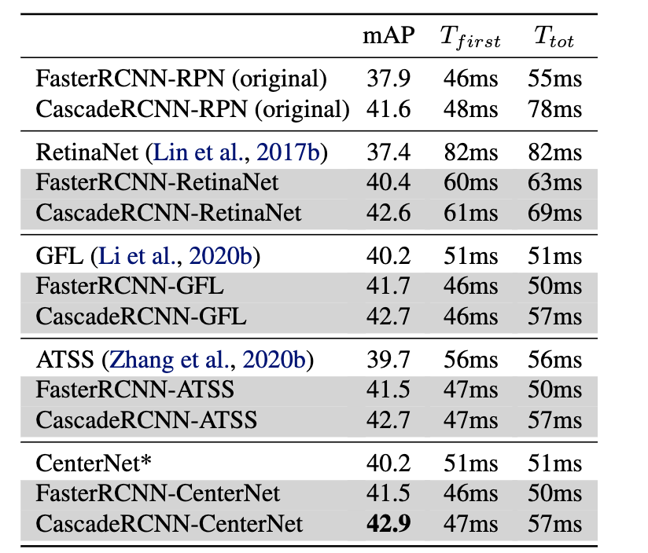
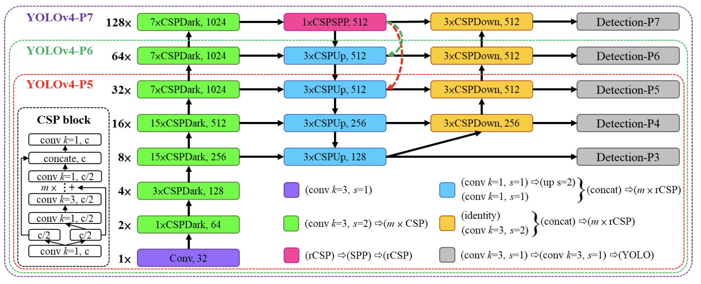
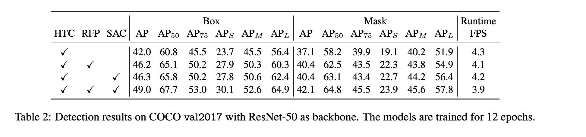
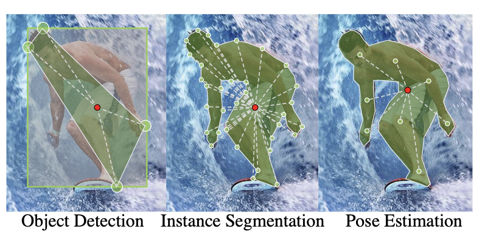
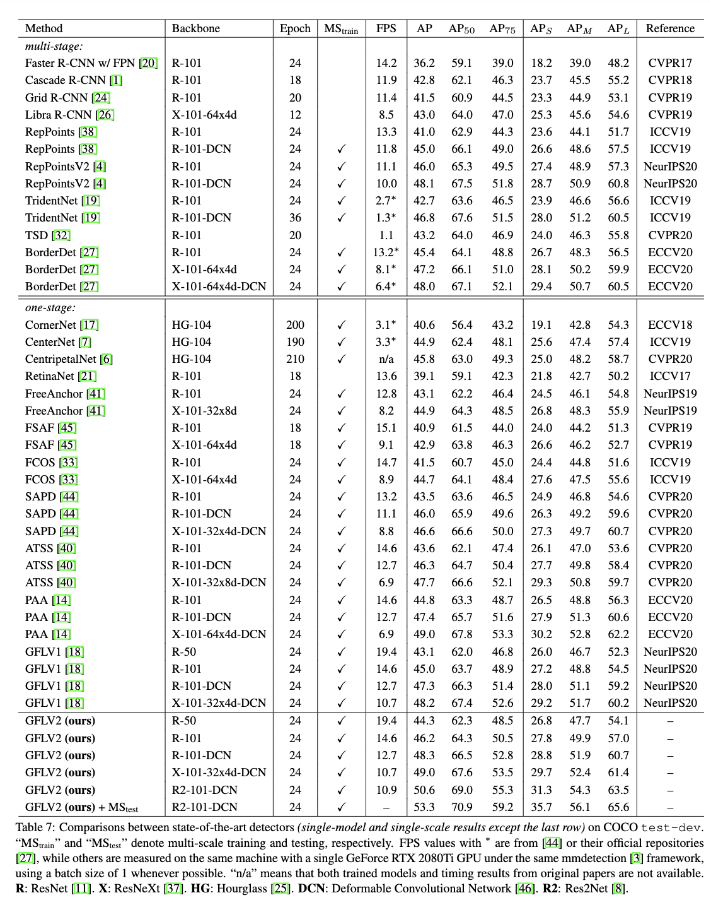
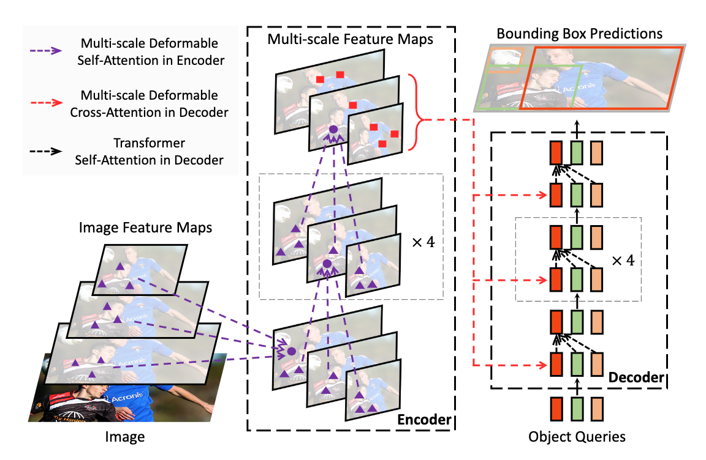

# COCO Leaderboard

Notes of top entries of COCO learderboard based on [paperswithcode](https://paperswithcode.com/sota/object-detection-on-coco) (up to 2022.3.22, deduplicated)

References: several zhihu articles (see my [collection list](https://www.zhihu.com/collection/792178490)) and CSDN blogs

[TOC]

## Summary

### Leaderboard

*Italic* denotes unique contribution

| Rank | Method            | AP box | Extra Data (Detection)                                       | Pretrain Data                    | Backbone            | Detector                        | Training                              | Scale  |
| ---- | ----------------- | ------ | ------------------------------------------------------------ | -------------------------------- | ------------------- | ------------------------------- | ------------------------------------- | ------ |
| 1    | DINO              | 63.3   | Object365                                                    | IN22K                            | SwinL               | *DINO* (DETR)                   |                                       | multi  |
| 2    | Swin v2           | 63.1   | Object365                                                    | IN22K-ext-70M                    | *SwinG*             | HTC++                           | *SimMIM*                              | multi  |
| 3    | Florence          | 62.4   | FLOD9M (COCO, O365, LVIS, OpenImages), IN22K self-training   | FLD900M                          | SwinH               | DyHead                          | *multimodal, multi-task*              | multi  |
| 4    | GLIP              | 61.5   | FourODs (O365, OpenImages, Visual Genome, ImageNetBoxes, -COCO), GoldG+(Flickr30K, VG  Caption, GQA) | 27M grounding data               | SwinL               | DyHead                          | *object-word contrastive pretraining* | multi  |
| 5    | Soft Teacher      | 61.3   | Object365                                                    | IN22K                            | SwinL               | HTC++                           | *semi-supervised*                     | multi  |
| 6    | DyHead            | 60.6   | IN22K self-training                                          | IN22K                            | SwinL               | *DyHead* (Mask RCNN)            |                                       | multi  |
| 7    | CBNet v2          | 60.1   |                                                              | IN22K                            | SwinL               | HTC                             | *composite backbone*                  | multi  |
| 8    | Focal Transformer | 58.9   |                                                              | Swin init, finetune on IN1K      | *Focal Transformer* | DyHead                          |                                       | multi  |
| 9    | YOLOR             | 57.3   |                                                              | IN1K                             | CSPDarkNet-53       | *YOLOR* (YOLOv4-CSP)            |                                       | single |
| 10   | CopyPaste         | 57.3   | self-training (unlabeled COCO, O365)                         | IN1K, JFT-300M (self-training)   | EfficientNet        | FPN                             | *data augmentation*                   | single |
| 11   | SOLQ              | 56.5   |                                                              | IN22K                            | SwinL               | *SOLQ* (DETR)                   |                                       | single |
| 12   | CenterNet2        | 56.4   |                                                              | IN1K                             | Res2Net101-DCN      | *CenterNet2 (CenterNet)*        | *anchor free*                         | single |
| 13   | QueryInst         | 56.1   |                                                              | IN22K                            | SwinL               | *QueryInst* (DETR)              |                                       | single |
| 14   | Scaled YOLOv4     | 55.8   |                                                              | IN1K                             | CSPDarkNet-53       | *scaled YOLOv4* (YOLOv4)        | *network scaling approach*            | single |
| 15   | DetectoRS         | 55.7   |                                                              | IN1K                             | ResNeXt101          | *DetectoRS* (HTC)               |                                       | multi  |
| 16   | Mish              | 55.2   |                                                              | IN1K                             | CSPDarkNet-53       | YOLOv4                          | *activation function*                 | multi  |
| 17   | Self-training     | 54.3   |                                                              | IN1K, OpenImages (self-training) | SpineNet-190        | RetinaNet                       | *self-training*                       | single |
| 18   | UniverseNet       | 54.1   |                                                              | IN1K                             | Res2Net101-DCN      | *UniverseNet* (RetinaNet)       |                                       | multi  |
| 19   | EfficientDet      | 53.7   |                                                              | IN1K                             | EfficientNet        | *EfficientDet* (FPN)            |                                       | single |
| 20   | PAA               | 53.5   |                                                              | IN1K                             | ResNeXt-152-DCN     | *PAA* (RetinaNet)               | *anchor assignment*                   | multi  |
| 21   | LSNet             | 53.5   |                                                              | IN1K                             | Res2Net-101-DCN     | *LSNet* (FPN)                   |                                       | multi  |
| 22   | ResNeSt           | 53.3   |                                                              | IN1K                             | *ResNeSt-200*       | Cascade-RCNN                    |                                       | multi  |
| 23   | GFL v2            | 53.3   |                                                              | IN1K                             | Res2Net-101-DCN     | *Generalized Focal Loss* (ATSS) | *loss function*                       | multi  |
| 24   | RelationNet++     | 52.7   |                                                              | IN1K                             | ResNeXt-101-DCN     | *RelationNet++*                 |                                       | multi  |
| 25   | Deformable DETR   | 52.3   |                                                              | IN1K                             | ResNeXt-101-DCN     | *Deformable DETR* (DETR)        |                                       | multi  |

### Latest Papers (should appear on leaderboard)

1. ViTDET 61.3 (MAE, ViT-H, Cascade Mask-RCNN, multi-scale)
2. CBNet v2 pretrained on BigDetection (Swin B) 59.5
3. DAT 53.0
4. CAE 52.3
5. MIMDet 51.5 (MAE, Mask RCNN, +1.2 compared with MAE)
6. CenterNet++ 57.1

### Related Papers (unordered)

1. ResNet
2. RCNN
3. Fast RCNN
4. Faster RCNN
5. Mask RCNN
6. FPN
7. Focal Loss (RetinaNet)
8. YOLOv4
9. DETR
10. Deformable Conv
11. SimMIM
12. DN-DETR
13. DAB-DETR
14. HTC
15. STAC
16. FixMatch
17. CenterNet
18. Swin Transformer
19. CLIP
20. EfficientNet
20. Res2Net
20. ResNeXt
20. CSPNet
20. NAS-FPN
20. PANet
20. ATSS
27. FCOS
28. RepPoints
29. Sparse RCNN
30. SEPC
31. Rethinking ImageNet Pre-Training

## Method

### 1. DINO

DINO: DETR with Improved DeNoising Anchor Boxes for End-to-End Object Detection

[论文](https://arxiv.org/abs/2203.03605v3)  [解读](https://zhuanlan.zhihu.com/p/478461226)

#### Method

基于DETR提出改进：

1. Contrastive De-Noising Training

在DN-DETR的基础上增加了对比学习，即正负样本同时添加噪声，对于每个anchor query需要完成降噪、判断有无物体。添加smaller noise的作为正样本，其他作为负样本，主要目的是改善box匹配，加速训练

2. Mixed Query Selection

与之前工作把anchor和query都设成静态（DETR；query太多，计算量大且难以收敛）或都设成动态（Deformable DETR；可能有多个物体或只有物体的一部分）不同，把Content Queries设为静态（可学习），Anchor Boxes设为动态（由encoder初始化）

3. Look Forward Twice

box refine时增加前一层的特征作为输入，类似于增大感受野

#### Experiments

| Contribution                    | Improvement |
| ------------------------------- | ----------- |
| mixed query selection           | +0.5        |
| look forward twice              | +0.4        |
| contrastive de-noising training | +0.5        |

| Comparison with     | Improvement (ResNet-50) |
| ------------------- | ----------------------- |
| DETR DC5            | +7.7                    |
| Dynamic DETR        | +3.8                    |
| DAB-Deformable-DETR | +4.1                    |
| DN-Deformable-DETR  | +2.4                    |

### 2. Swin v2

Swin Transformer V2: Scaling Up Capacity and Resolution

[论文](https://arxiv.org/abs/2111.09883v2)  [解读](https://mp.weixin.qq.com/s/R_dIyv7ain5FU7WS69Q_oA)

#### Method

Swin v1：移动窗口和层级结构，增加了卷积中的归纳偏置（局部性和平移不变性），同时降低运算量，对底层计算量优化友好

Swin v1的问题：

1. 随着层数加深，深层激活值提升，特征方差变大，变得不稳定
2. 分辨率改变时性能下降

改进：

1. 对于方差大的问题，将LayerNorm移动到MLP/Attention之后，残差连接之前
2. 对于attention map易被少数像素主导的问题，将attention计算方式改成scaled cosine
3. 对于跨分辨率问题，提出log continuous position bias，减少插值比率
4. 一些工程技巧减少显存占用
5. 额外数据：ImageNet-22K扩展五倍；自监督训练（SimMIM）

#### Experiment

| Contribution                        | Improvement (Swin-B, ImageNet) |
| ----------------------------------- | ------------------------------ |
| post-norm                           | +0.2                           |
| scaled cosine attention             | +0.3                           |
| log-spaced continuous position bias | +0.3                           |

| Comparison with | Improvement |
| --------------- | ----------- |
| SwinV1-L        | +4.4        |
| SwinV2-L        | +2.3        |
| SoftTeacher     | +1.8        |

### 3. Florence

Florence: A New Foundation Model for Computer Vision

[论文](https://arxiv.org/abs/2111.11432v1)  [解读](https://zhuanlan.zhihu.com/p/437173593)

#### Method

计算机视觉任务:分类、检索、检测、VQA、Image Caption、视频检索、动作识别

迁移学习：finetune，linear probing，few shot，zero shot

与CLIP等多模态模型相比，扩展到了object级别、视频特征

图片encoder使用swin等，文本使用roberta，进行Unified Constrastive Learning。检测部分使用Dynamic Head模型

#### Experiment

| Comparison with | Improvement |
| --------------- | ----------- |
| DyHead          | +1.8        |
| SoftTeacher     | +1.1        |

### 4. GLIP

Grounded Language-Image Pre-training

[论文](https://arxiv.org/abs/2112.03857v1)  [解读](https://zhuanlan.zhihu.com/p/489600809)

#### Method

统一phrase grounding和detection，利用grounding数据进行物体和文本的对比学习

与CLIP不同，使用Deep Fusion融合文本和视觉encoder

可以zero shot预测训练数据中未出现的类别，在LVIS上也有提升

#### Experiment

| Contribution                                              | Improvement |
| --------------------------------------------------------- | ----------- |
| (A) reply on phrase grounding; word-region alignment loss | -0.4        |
| (B) language-aware deep fusion                            | +0.9        |
| (C) GoldG dataset (remove COCO images)                    | +1.3        |
| Cap4M                                                     | -0.2        |
| CC3M, SBU                                                 | +0.3        |
| COCO                                                      | +0.5        |

| Comparison with | Improvement |
| --------------- | ----------- |
| DyHead          | +1.2        |
| Soft Teacher    | +0.8        |

### 5. Soft Teacher

[论文](https://arxiv.org/abs/2106.09018v3)  [解读](https://zhuanlan.zhihu.com/p/437754834)

#### Method

半监督目标检测，使用伪标签，相比于STAC特色是端到端

在每个训练 step 中同时进行生成伪标签、利用伪标签对无标签图片进行训练。在每个batch中随机抽样有标签和无标签数据，student模型进行检测训练，teacher模型（student的EMA平均）对无标签数据生成伪标签

类似FixMatch，无监督数据进行强弱两种增强，分别进入student和teacher。性能依赖于伪标签的质量

cls伪标签：伪标签质量有限，若用较高的阈值则会造成召回率低。因此采用低阈值+soft teacher，使用teacher模型的分类分数来加权student模型预测proposal的loss

reg伪标签：高可靠性（方差低）的proposal用于student定位分支的训练。方差采用box jittering，多次抖动伪前景框proposal，利用teacher模型进行回归

#### Experiment

| Contribution                  | Improvement |
| ----------------------------- | ----------- |
| Soft Teacher (BG-T indicator) | +2.4        |
| box jittering                 | +0.6        |
| Object365                     | +0.9        |

| Comparison with   | Improvement |
| ----------------- | ----------- |
| Proposal learning | +2.6        |
| STAC              | +3.9        |
| self-training     | +2.8        |

### 6. Dynamic Head

Dynamic Head: Unifying Object Detection Heads with Attentions

[论文](https://arxiv.org/abs/2106.08322v1)  [解读](https://zhuanlan.zhihu.com/p/384587313)

#### Method

在一个head里同时实现三种感知。对feature pyramid连续进行三种attention操作，分别针对scale, spatial和task，即layer, space(H,W), channel三个维度

dynamic head模块可以添加到one-stage和two-stage检测器中，one-stage中放在FPN backbone后、class box center的分类器前，two-stage中将最后一个task-aware attention放在ROI Pooling后、class box分类器前，其余的放在ROI Pooling前

#### Experiment

| Contribution            | Improvement |
| ----------------------- | ----------- |
| scale-aware attention   | +0.9        |
| spatial-aware attention | +2.4        |
| task-aware attention    | +1.3        |

| Comparison with | Improvement |
| --------------- | ----------- |
| ATSS            | +3.3        |
| BorderDet       | +3.7        |
| RepPoints v2    | +1.9        |
| Deformable DETR | +1.7        |
| RelationNet++   | +1.3        |

### 7. CBNet v2

CBNetV2: A Composite Backbone Network Architecture for Object Detection

[论文](https://arxiv.org/abs/2107.00420v6)  [解读](https://zhuanlan.zhihu.com/p/386350290)

#### Method

将多个相同结构Backbone使用Dense Higher-Level Composition的方式组合在一起，每个layer给所有更浅layer提供输入，即每一层接收具有更高级语义信息（空间尺度更小）的层作为输入

为了避免深度带来的训练困难，在训练时使用assisting backbone（前K-1个backbone中的每个）的输出训练同样权重的detection head1，loss作为assistant supervision

#### Experiment

| Contribution | Improvement |
| ------------ | ----------- |
| Dual         | +1.4        |
| Triple       | +1.8        |
| DHLC         | +1.0        |
| Supervision  | +1.1        |

| Comparison with | Improvement |
| --------------- | ----------- |
| Swin-L (HTC++)  | +1.4        |

### 8. Focal Transformer

Focal Self-attention for Local-Global Interactions in Vision Transformers

[论文](https://arxiv.org/abs/2107.00641v1)  [解读](https://zhuanlan.zhihu.com/p/392434318)

#### Method

粗粒度导致sub-optimal，细粒度导致计算开销过大。以细粒度的方式关注离自己近的token，以粗粒度的方式关注离自己远的token。将较远的patch进行pooling聚合，增大感受野

但显存占用和计算量较大，对高分辨率的预测任务不友好

#### Experiment

| Contribution       | Improvement |
| ------------------ | ----------- |
| window size 14     | +0.6        |
| window shift       | +0.1        |
| local interaction  | +5.1        |
| global interaction | +3.4        |

| Comparison with | Improvement |
| --------------- | ----------- |
| Swin-Base       | +1.3        |

### 9. YOLOR

You Only Learn One Representation: Unified Network for Multiple Tasks

[论文](https://arxiv.org/abs/2105.04206v1)  [解读](https://zhuanlan.zhihu.com/p/454021143)

#### Method

提出了一个统一的网络来同时编码显式知识和隐式知识，在网络中执行了核空间对齐、预测细化和多任务学习来学习隐式知识，同时对多个任务形成统一的表示

隐式知识：

1. 利用投影向量的内积和隐式表示来达到降低流形空间维度的目的

   

2. 对输出特征和隐式表征进行加法和乘法运算，这样就可以对核空间进行变换、旋转和缩放，以对齐神经网络的每个输出核空间

3. 引入加法，预测中心坐标的偏移；引入乘法，搜索锚框的超参数集；分别使用点乘和concat来执行多任务特征选择

   

传统神经网络的表示空间专注于特定任务，对于其他任务不变。通用的网络希望对于所有潜在任务都有效。

特征对齐：在FPN的每一个特征映射层添加隐式知识进行特征对齐

目标检测预测细化：在YOLO的每一个输出层添加隐式知识进行预测细化

为训练多任务训练一个规范的表征，通过给每个任务分支引入隐式表征增强表征能力

总结：引入隐式知识，仅增加不到万分一的参数量和计算量，模型性能得到有意义的提升，同时收敛更快。

#### Experiment

| Contribution                       | Improvement          |
| ---------------------------------- | -------------------- |
| feature alignment                  | +0.1 (0.5 for S,M,L) |
| prediction refinement              | +0                   |
| implicit joint detection embedding | +0.3                 |
| addition operator                  | +0.1(iFR),+0(iPA)    |
| multiplication operator            | -0.4(iFR),+0.2(iPA)  |
| concatenation                      | 0(iFR)               |
| vector implicit knowledge          | +0.1                 |
| neural network                     | +0                   |
| matrix factorization               | +0.2                 |

| Comparison with         | Improvement |
| ----------------------- | ----------- |
| YOLOv4-P6-light         | +1.1        |
| implicit (un-finetuned) | +0.6        |

### 10. CopyPaste

Simple Copy-Paste is a Strong Data Augmentation Method for Instance Segmentation

[论文](https://arxiv.org/abs/2012.07177v2)  [解读](https://zhuanlan.zhihu.com/p/338085877)

#### Method

将一个图片的物体直接复制到另一个图片。与之前的复制粘贴方法不同，不需要对上下文建模获取粘贴位置

未使用旋转、高斯模糊，使用了水平翻转、大尺度抖动

作为半监督训练方法：对未标记数据生成伪标签、将ground truth实例粘贴进来作为新数据

baseline模型在LVIS 2020挑战赛获胜者的基础上提升3.6%

#### Experiment

| Contribution  | Improvement |
| ------------- | ----------- |
| self-training | +1.5        |
| Copy-Paste    | +1.5        |

| Comparison with | Improvement |
| --------------- | ----------- |
| Eff-B7 FPN      | +1.5        |

### 11. SOLQ

SOLQ: Segmenting Objects by Learning Queries

[论文](https://arxiv.org/abs/2106.02351v3)  [解读](https://zhuanlan.zhihu.com/p/379050184)

#### Method

主要目的是用DETR来做实例分割。左图的FPN形式增加mask head并不work，猜测是因为mask分支和DETR结构之间的gap太大了

采用右图方式在DETR上增加预测mask的head。其中主要贡献是UQR模块，解决的问题是mask是二维的feature map，而cls和box都是一维的vector。UQR将mask从二维feature map压缩编码到一维向量，从而可以用head预测。测试时将一维向量解码为mask。编解码方式有Sparse Coding, PCA, DCT

#### Experiment

| Contribution | Improvement |
| ------------ | ----------- |
| DCT          | +1.9        |

| Comparison with       | Improvement (ResNet-101) |
| --------------------- | ------------------------ |
| Deformable DETR       | +2.0                     |
| Deformable DETR + SQR | +1.9                     |

### 12. CenterNet2

Probabilistic two-stage detection

[论文](https://arxiv.org/abs/2103.07461v1)  [解读](https://zhuanlan.zhihu.com/p/358869950)

#### Method

one-stage检测器：一个框架中共同推断位置和类别的概率。通过训练它们最大限度地提高其框的精度和预测概率的精度，并在最后应用到推理之中。依赖于单独分类和回归分支；类别很多时（如LVIS）速度不再比two-stage快

two-stage 检测器：首先发现潜在目标及其位置，然后(在第2阶段)对这些潜在目标进行分类。第1阶段的目的是最大限度地召回目标，而第2阶段是最大限度地在第1阶段过滤的目标。相对较弱的RPN，召回排名前1K的proposal，减慢了速度

本文提出了概率两阶段模型，将一个强大的One-Stage Detector与后面的分类阶段集成在一起，在第1阶段使用更少、质量更高的预选框，以输出更高的准确性和更快的速度。**第1阶段预测class agnostic概率，第2阶段预测分类分数，进行相乘**

使用FPN将CenterNet升级到多尺度。然后一阶段使用CenterNet，二阶段使用Faster RCNN / Cascade RCNN

#### Experiment

| Contribution               | Improvement |
| -------------------------- | ----------- |
| second stage probabilities | -0.1        |
| 4 layer first stage head   | +0.3        |
| focal loss                 | +0.5        |

| Comparison with           | Improvement |
| ------------------------- | ----------- |
| CenterNet one-stage       | +2.7        |
| CascadeRCNN-RPN two-stage | +1.3        |

### 13. QueryInst

Instances as Queries

[论文](https://arxiv.org/abs/2105.01928v3)  [解读](https://blog.csdn.net/xijuezhu8128/article/details/118675968)

#### Method

构建有效的基于 Query 的端到端实例分割算法

在DETR中的transformer block中加入mask head，box和mask进行多阶段迭代优化，并将query作为输入

对于Cascade Mask R-CNN和HTC，在统计意义上细化了不同阶段proposal的质量。对于每个阶段，训练样本的数量和分布都有很大的不同，在不同阶段中，每个单独的proposal没有明确的内在对应

对于QueryInst，各个阶段之间的连接是通过query中固有的一一对应自然建立的这种方法消除了显式多阶段mask head连接和proposal分布不一致的问题

#### Experiment

| Contribution         | Improvement |
| -------------------- | ----------- |
| parallel supervision | +0.3        |
| DynConv mask         | +0.3        |
| shared MSA           | +0.5        |
| shared query         | +0.7        |

| Comparison with    | Improvement (ResNet-101) |
| ------------------ | ------------------------ |
| Cascade Mask R-CNN | +1.9                     |
| HTC                | +1.8                     |
| Sparse R-CNN       | +1.8                     |

### 14. Scaled YOLOv4

Scaled-YOLOv4: Scaling Cross Stage Partial Network

[论文](https://arxiv.org/abs/2011.08036v2)  [解读](https://zhuanlan.zhihu.com/p/298584493)

#### Method

提出了一种网络缩放方法，修改深度，宽度，分辨率，还可以修改网络的结构

对yolov4进行了重新设计，提出了YOLOv4-CSP，然后基于onYOLOv4-CSP开发了scale - yolov4。新的架构可以有效地减少ResNet、ResNeXt和Darknet上的FLOPs，分别减少23.5%、46.7%和50.0%

对于tiny模型，控制计算量、feature map尺寸、保持卷积后通道数相同、最小化卷积输入/输出

对于large模型，更好地预测物体大小的能力基本上取决于特征向量的感受野

#### Experiment

| Comparison with | Improvement |
| --------------- | ----------- |
| YOLOv4          | +2.0        |
| YOLOv3-SPP      | +6.7        |

### 15. DetectoRS

DetectoRS: Detecting Objects with Recursive Feature Pyramid and Switchable Atrous Convolution

[论文](https://arxiv.org/abs/2006.02334v2)  [解读](https://zhuanlan.zhihu.com/p/146151042)

#### Method

在宏观层面上，提出了Recursive Feature Pyramid，将FPN的额外反馈连接加入到自下而上的backbone层中。使用带有空洞卷积的空间金字塔池化（ASPP）模块来实现两个递归特征金字塔的级联连接。融合模块通过卷积层和Sigmoid运算来计算注意力图，然后将结果注意力图用于计算更新后的加权和

在微观层面上提出Switchable Atrous Convolution，以不同的空洞率进行卷积，使用switch函数合并。将主干网络ResNet中的每个3x3卷积层都转换为SAC，从而在不同的空洞率之间实现对卷积计算的软切换

#### Experiment

| Contribution                  | Improvement |
| ----------------------------- | ----------- |
| Recursive Feature Pyramid     | +4.2        |
| Switchable Atrous Convolution | +4.3        |

| Comparison with | Improvement (ResNet-50) |
| --------------- | ----------------------- |
| HTC             | +7.7                    |

### 16. Mish

Mish: A Self Regularized Non-Monotonic Activation Function

[论文](https://arxiv.org/abs/1908.08681v3)  [解读](https://zhuanlan.zhihu.com/p/84418420)

#### Method

提出了新激活函数：$Mish(x)=x · tanh(ln(1+e^x))$

无边界(即正值可以达到任何高度)避免了由于封顶而导致的饱和。对负值的轻微concavity允许更好的梯度流，而不是像ReLU中那样的硬零边界。

平滑的激活函数允许更好的信息深入神经网络，从而得到更好的准确性和泛化

尽管如此，测试了许多激活函数，大多数都无法执行。主要区别可能是Mish函数在曲线上几乎所有点上的平滑度

#### Experiment

| Contribution   | Improvement |
| -------------- | ----------- |
| CSP-DarkNet-53 | +0.4        |
| YOLOv4 pacsp-x | +0.9        |

### 17. Rethinking Pre-training and Self-training

Rethinking Pre-training and Self-training

[论文](https://arxiv.org/abs/2006.06882v2)  [解读](https://zhuanlan.zhihu.com/p/151382382)

#### Method

延续何恺明的Rethinking ImageNet Pre-Training，通过大量的实验验证了在检测和分割任务中 Pre-training 和 Self-training 的效果

- 对于 Pre-training
  - 当使用更强大的**数据增强**方案时，预训练反而会**损害**模型的性能
  - 可用标注数据越多，预训练的作用越小，价值越低

- 对于 Self-training
  - Self-training 在使用高强度数据增强策略时仍能够提升性能，即使当预训练已经会损害性能时
  - Self-training 在各种标注数据规模下都具能提升性能，并可以与预训练共同起作用

- 对于 Self-supervised pre-training 同样在高强度数据增强策略时会损害性能

数据增强：使用四种不同的数据增强策略，依次增强，第一种是和Rethinking ImageNet Pre-Training中一致，后三种来自 AutoAugment 和 RandAugment

self-training：能提升性能，但相对于预训练来说会花1.3x-8x的时间。首先在有监督数据训练teacher模型，然后在无监督数据上生成伪标签，最后训练student基于监督标签和伪标签优化。并设计了一种loss正则化的方法

作者猜测预训练效果不佳是由于 pre-training 无法感知检测或分割任务感兴趣的地方并且无法适应，例如 ImageNet 上训练好的特征可能忽视了检测任务所需的位置信息

联合训练：表示同时训练 ImageNet 分类和 COCO 的对象检测，实验结果 表明使用 350 epochs 的预训练模型进行初始化能够取得 +2.6AP的提升，但使用联合训练只需要在 ImageNet 上训练 19 epochs 就能获得 +2.9AP 的提升。此外预训练，自训练，联合训练加一起能够得到更大的提升。

对齐任务：self-training 能够对齐任务，之前的实验中 Open Images 不能提升 COCO 性能，但附录的实验中self-training 能够用 Open Images 提升 COCO 指标

#### Experiment

| Comparison with            | Improvement |
| -------------------------- | ----------- |
| random init                | +0.8        |
| ImageNet init (supervised) | +1.5        |
| ImageNet init (SimCLR)     | +1.5        |

### 18. USB

USB: Universal-Scale Object Detection Benchmark

[论文](https://arxiv.org/abs/2103.14027v2)  [解读](https://blog.csdn.net/m0_48360907/article/details/115254965)

#### Method

提出了Universal-Scale object detection benchmark，将COCO, Waymy Open Dataset, Manga109组合起来，包含不同尺寸的物体。以及用于训练和评估的protocols、指标等

UniverseNet: 在RetinaNet基础上，使用ATSS, SEPC, DCN，多尺度训练，加入GFL, SyncBN, iBN

#### Experiment

| Contribution         | Improvement |
| -------------------- | ----------- |
| SEPC                 | +1.7        |
| Res2Net-v1b          | +2.8        |
| DCN                  | +1.6        |
| multi-scale training | +1.6        |
| GFL                  | +0.8        |
| SyncBN, iBN          | +1.7        |

| Comparison with | Improvement |
| --------------- | ----------- |
| RetinaNet       | +12.2       |
| RelationNet++   | +1.4        |

### 19. EfficientDet

EfficientDet: Scalable and Efficient Object Detection

[论文](https://arxiv.org/abs/1911.09070v7)  [解读](https://zhuanlan.zhihu.com/p/142568498)

#### Method

提出BiFPN：结合了NAS-FPN和PANet，保留了双向融合和跳级连接，变为可重复block。采用加权（权重可学习）平均的方法融合不同层的特征

模型scaling方法：涉及到backbone的网络深度、宽度、输入尺寸，BiFPN的深度、宽度，box/class预测网络的深度、宽度。因为搜索空间大，人为地缩小了搜索空间，然后使用启发式的方法来确定upscale的参数

#### Experiment

| Contribution | Improvement |
| ------------ | ----------- |
| BiFPN        | +3.1        |
| weighted     | +0.4        |

| Comparison with      | Improvement |
| -------------------- | ----------- |
| AMoebaNet+NAS-FPN+AA | +1.1        |

### 20. PAA

Probabilistic Anchor Assignment with IoU Prediction for Object Detection

[论文](https://arxiv.org/abs/2007.08103v2)  [解读](https://zhuanlan.zhihu.com/p/254683633)

#### Method

主要是针对当下anchor-based model中anchor标签的分配问题加以改进，传统的方法是计算bounding box与target box之间的IOU，如果这个值大于正阈值，那么将其作为正样本，小于负样本阈值则将其作为负样本，其余的忽略。这样做有几个缺陷

- 忽视了bounding box本身的内容，bbx和target的交集本身可能会包含大量的背景噪声
- 在测试阶段是没有target，无法计算IOU，造成了测试阶段和训练阶段的不一致

本文提出了一个给anchor分配标签的概率模型，和一个后处理的方法，优势如下：

1. 分配标准取决于分类精度和IOU的组合，而不单单取决于IOU，这对model的增益更大（focus分类精度使得这个metric可以考虑box本身的内容）

2. 通过混合高斯分布GMM对正负样本进行建模，可解释性强。正样本和负样本的**分数分布**分别用一个高斯分布刻画，通过EM算法优化

   

3. 丢掉了IOU阈值，正样本数目等超参数，模型更稳定

4. 通过修改网络结构对box与GT的IOU进行预测（在class和box预测头上增加一个head），训练阶段有真实的IOU作为label，测试阶段可以预测IOU，使得训练和测试阶段保持一致

   

#### Experiment

| Contribution | Improvement |
| ------------ | ----------- |
| PAA          | +0.5        |
| IoU pred     | +1.0        |
| voting       | +0.2        |

| Comparison with | Improvement |
| --------------- | ----------- |
| FCOS            | +3.4        |
| MAL             | +0.7        |
| ATSS            | +1.0        |

### 21. LSNet

Location-Sensitive Visual Recognition with Cross-IOU Loss

[论文](https://arxiv.org/abs/2104.04899v1)  [解读](https://zhuanlan.zhihu.com/p/366651996)

#### Method

将目标检测、实例分割、姿态估计三个任务统一。首先预测中心点，然后对三个任务分别预测四个极值点向量/N个轮廓点向量、13个关键点向量。设计了Cross IoU loss将IoU降低到一维进行计算，效果好于smooth L1 loss

回归过程采取了init+refine的方式。先回归一组初始的向量，这些向量已经比较接近关键点。利用Pyramid DCN获取这些关键点处的特征，也就是说DCN不仅只在目标所在的FPN层计算，还会把DCN的offsets等比例映射至相邻的FPN层进行计算，将三层的所得特征相加，形成最终的关键点特征。利用这些特征再预测一组向量，两组向量叠加最终形成预测向量

#### Experiment

| Contribution                   | Improvement |
| ------------------------------ | ----------- |
| Cross IoU                      | +0.5        |
| Pyramid extreme point features | +1.9        |

| Comparison with | Improvement (X101-64X4D-dcn) |
| --------------- | ---------------------------- |
| RepPointsV2     | -1.7                         |
| BorderDet       | +0.1                         |
| ATSS            | -0.3                         |
| PAA             | -1.0                         |

### 22. ResNest

ResNeSt: Split-Attention Networks

[论文](https://arxiv.org/abs/2004.08955v2)  [解读](https://zhuanlan.zhihu.com/p/197890218)

#### Method

在SENet，SKNet，ResNeXt的基础上提出了Split-Attention模块，用于替换ResNet中四个stage的conv。在分类、检测、分割上都有非常明显的提升。Split-Attention即在每个分组内用attention

#### Experiment

| Contribution    | Improvement (ImageNet) |
| --------------- | ---------------------- |
| mixup           | +0.8                   |
| autoaug         | +0.3                   |
| ResNeSt-50-fast | +1.2                   |
| ResNeSt-50      | +0.5                   |

| Comparison with | Improvement (Cascade-RCNN) |
| --------------- | -------------------------- |
| ResNet50        | +5.0                       |
| ResNet101       | +3.5                       |

### 23. GFL v2

Generalized Focal Loss V2: Learning Reliable Localization Quality Estimation for Dense Object Detection

[论文](https://arxiv.org/abs/2011.12885v1)  [解读](https://zhuanlan.zhihu.com/p/313684358)

#### Method

GFL v1：one-stage anchor-free的检测器（以FCOS，ATSS为代表）会包含3个表示：class、box、centerness/IoU等质量估计。他们在训练和测试时并不一致：用法（训练时分别使用，测试时乘起来）、对象不一致（class针对正负样本但质量估计针对正样本，负样本质量估计是未定义行为）。解决方法：使用class和质量估计的共同表征，在NMS筛选评分时好于IoU/centerness

此外bbox regression 采用的表示不够灵活，建模了非常单一的狄拉克分布，非常不flexible。解决方法：用离散化的方式，通过softmax来实现

采用QFL（Focal Loss拓展到连续label）和DFL（以类似交叉熵的形式去优化与标签y最接近的一左一右两个位置的概率，从而让网络快速地聚焦到目标位置的邻近区域的分布），统称为GFL

GFL v2：利用bbox分数（预测每一个y处是否是bbox的边）分布图的topK（刻画分布情况，如双峰等）帮助预测定位质量，增加的计算量很小，提升显著

#### Experiment

| Contribution            | Improvement |
| ----------------------- | ----------- |
| distribution statistics | +1.2        |
| decompoed form          | +0.9        |

| Comparison with | Improvement (R-101-DCN) |
| --------------- | ----------------------- |
| GFLv1           | +1.0                    |
| PAA             | +0.9                    |
| ATSS            | +2.0                    |

### 24. RelationNet++

RelationNet++: Bridging Visual Representations for Object Detection via Transformer Decoder

[论文](https://arxiv.org/abs/2010.15831v1)  [解读](https://zhuanlan.zhihu.com/p/470166987)

#### Method

RelationNet：参考attention，提出object relation模块，根据几何和外观特性计算object之间的关系，增强当前object的特征，提高bbox和class的预测；在duplicate removal中加入object relation模块，根据几何和外观特性计算分数，设定阈值进行筛选，代替NMS

RelationNet++：提出了基于注意力的BVR模块。物体表示方式中，中心点更利于小目标识别，角点则能够更精细地定位。BVR以算法原本的表示方式为主特征，加入其它表示方式作为辅助特征，通过attention融合预测框、中心点和角点三种目标表示方式。BVR能够无缝地嵌入到各种目标检测算法中，带来不错的收益

#### Experiment

| Contribution                       | Improvement |
| ---------------------------------- | ----------- |
| sub-pixel corner/centers           | +1.5        |
| shared relative location embedding | +2.9        |
| appearance term                    | +1.8        |
| geometry term                      | +2.0        |
| BVR() on RetineNet)                | +1.8        |

| Comparison with | Improvement |
| --------------- | ----------- |
| ATSS            | +2.0        |

### 25. Deformable DETR

Deformable DETR: Deformable Transformers for End-to-End Object Detection

[论文](https://arxiv.org/abs/2010.04159v4)  [解读](https://zhuanlan.zhihu.com/p/447554938)

#### Method

针对DETR的缺点：初始化时attention weights为0，需要大量迭代达到sparse；对feature map每个点进行attention计算的复杂度极高

提出deformable attention，参考DCN，对于feature map的每层（multi-scale）预测K个点，仅对KL个点进行attention计算

在每一层对bbox进行迭代修正

two-stage：第一阶段用encoder only的Deformable DETR生成proposal，直接选取TopK个proposal（不经过NMS）输入到第二阶段作为object queries

#### Experiment

| Contribution              | Improvement        |
| ------------------------- | ------------------ |
| Deformable DETR           | +0.5 (less epochs) |
| iterative bbox refinement | +1.6               |
| two-stage                 | +0.8               |
| BiFPN                     | +0.1               |
| Multi-scale inputs        | +1.7               |
| number of sampling points | +0.9               |
| Multi-scale attention     | +1.5               |

| Comparison with | Improvement           |
| --------------- | --------------------- |
| DETR            | +2.9 (less epochs)    |
| ATSS            | +1.6 (ResNeXt101+DCN) |

